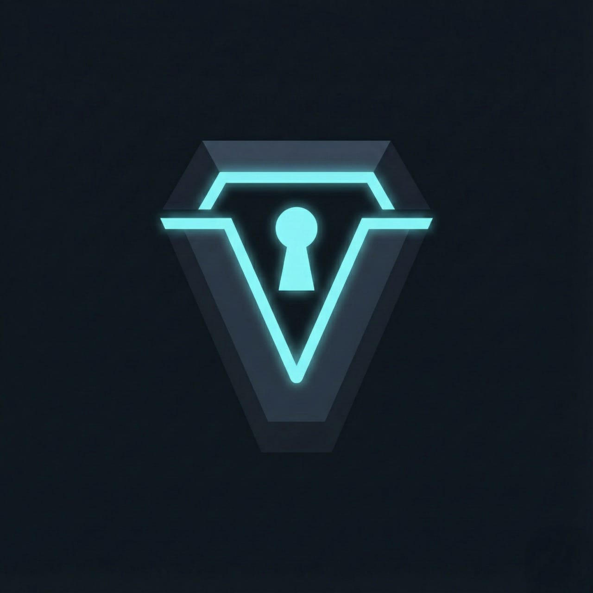

# ⚫ VoidCasket

> **Offline Zero-Knowledge Encrypted Password Vault**


<p align="center">
  
</p>

---

## Overview

**VoidCasket** is a **local-only, zero-knowledge password vault** built with modern cryptography and mandatory two-factor authentication.

It is designed for users who **do not trust browsers, cloud sync, or third-party servers**.

All secrets are:

* Stored **offline**
* Encrypted **twice**
* Accessible only with a **master password + TOTP 2FA**

No telemetry.
No cloud.
No recovery backdoors.

---

## Features

### Security & Cryptography

* Master password hashing using **Argon2**
* Mandatory **TOTP-based 2FA** (Google Authenticator / Authy)
* Dual-layer encryption:

  * **ChaCha20-Poly1305** (inner layer)
  * **AES-256-GCM** (outer layer)
* Keys derived via **PBKDF2-SHA512 (200k iterations)**

### Vault Management

* Encrypted credential storage (service, username, password)
* Instant search across vault entries
* Secure clipboard copy with **auto-clear**
* Add / delete entries in real time
* One-click system lock

---

## How It Works

* **Setup Phase**

  * User creates a master password
  * A TOTP secret is generated and enrolled via QR code
  * Password hash and encrypted 2FA secret are stored securely

* **Login Phase**

  * Master password is verified using Argon2
  * TOTP code is validated
  * Vault is decrypted **only in memory**

* **Storage**

  * Vault data is encrypted before touching disk
  * No plaintext credentials are ever written to storage

---

## Installation

### Option 1: Windows Executable (Recommended)

1. Download `VoidCasket.exe` from the **Releases** page
2. Place it in a **secure folder**
3. Run directly — no setup required

---

### Option 2: Run from Source

```bash
git clone https://github.com/BGx-11/VoidCasket.git
cd VoidCasket
pip install -r requirements.txt
python gui_main.py
```

---

## Usage

1. Launch **VoidCasket**
2. Initialize vault (first run only)
3. Scan QR code with an authenticator app
4. Authenticate using password + 2FA
5. Add, search, copy, or delete credentials
6. Lock the vault when finished

---

## ⚠️ Data Storage Warning

VoidCasket creates a local **`data/`** directory **inside the same folder where the application or `VoidCasket.exe` is located**.

This directory contains your **encrypted vault file**:

```text
data/
└── void.dat
```

### Important Notes

* Do **not** delete, move, or rename the `data/` folder
* Keep the application directory **private and secure**
* Anyone with access to this folder can attempt offline attacks
* Losing this folder means **permanent loss of your vault**

> VoidCasket does **not** use cloud storage or automatic backups by design.

---

## Project Structure

```text
VoidCasket/
├── data/
│   └── void.dat
├── casket_logic/
│   ├── auth.py
│   ├── crypto.py
│   └── database.py
├── gui_main.py
├── logo.ico
├── requirements.txt
├── VoidCasket.exe
└── README.md
```

---

## Disclaimer

**VoidCasket is intended for educational and personal security use only.**

* There is **no password recovery**
* Losing your master password or vault file means **permanent data loss**
* Do not use on compromised or untrusted systems

---

## License

Licensed under the **MIT License**.

---

<p align="center">
<strong>Developed by BGx (Devansh Agarwal)</strong><br>
<em>Cybersecurity Enthusiast & Developer</em>
</p>

